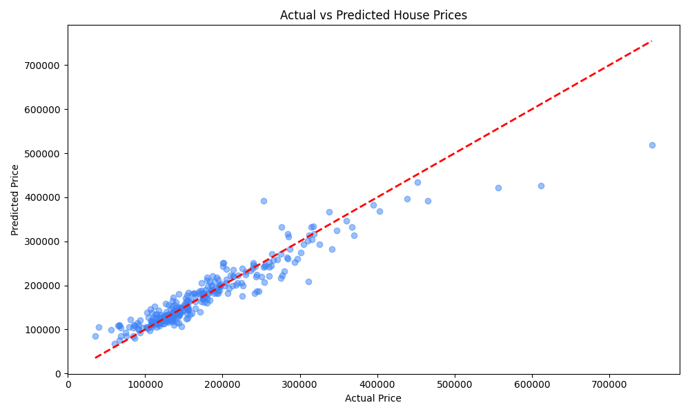
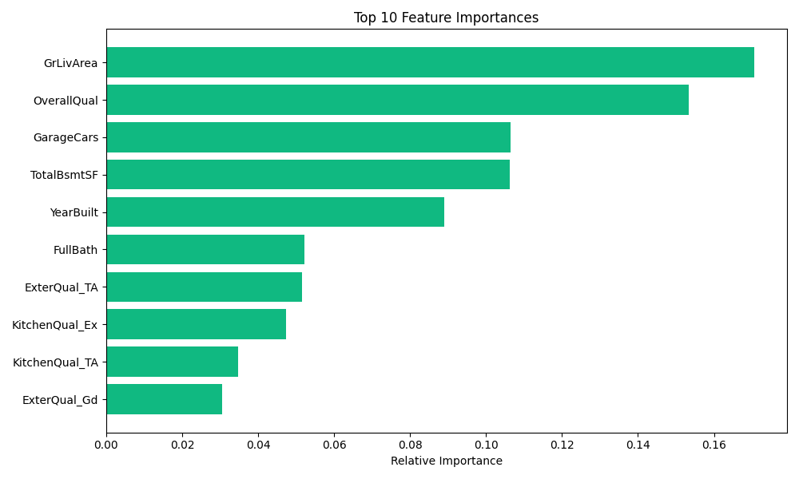
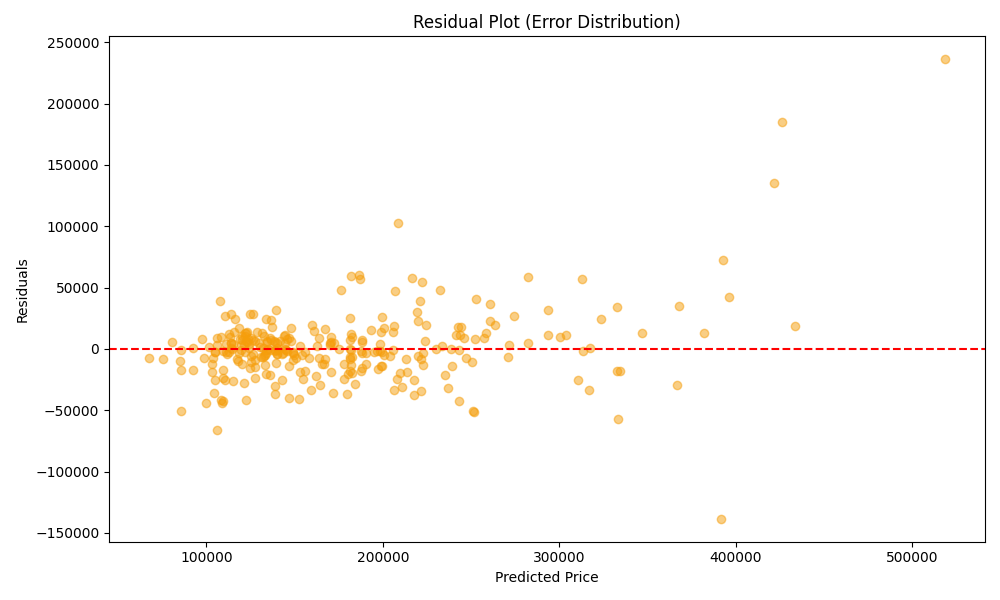

<h1 align="center">House Price Prediction AI</h1>

An end-to-end Machine Learning solution for real estate valuation

Introduction

This repository contains the Python source code for a House Price Prediction system using the Ames Housing Dataset. With this project, you can:

Train a high-performance model: Achieve $R^2 \ge 0.89$ using optimized Random Forest.

Visualize Insights: Automatically generate feature importance, residual plots, and error distributions.

Deploy a Web App: Run a local Flask server with a clean UI to predict prices in real-time.

Containerize: Deploy anywhere using the provided Docker configuration.

Web Application

The web app allows users to input house specifications and receive an instant price estimation. It is built with Flask and styled with Tailwind CSS.

<i>Inference result visualization (Actual vs Predicted)</i>

Dataset

The model is trained on the Ames Housing Dataset from Kaggle. It contains 79 explanatory variables describing almost every aspect of residential homes in Ames, Iowa.

Key Features Used

The table below shows the primary features selected for our predictive model:

Overall Quality

Living Area (sqft)

Garage Capacity

Basement Area

Year Built

Full Bathrooms

Neighborhood

Exterior Quality

Kitchen Quality

Building Type

Total Area

Room Count

Project Structure

house_price_project/
├── app/                  # Flask Web Application & UI Templates
├── config/               # System configuration (config.yaml)
├── data/                 # Raw and processed datasets
├── logs/                 # Training and operational logs
├── models/               # Saved models (final_model.joblib)
├── reports/              # Metrics.json and Evaluation Figures
├── src/                  # Core Logic (Preprocessing, Features, Training, Viz)
├── tests/                # Unit tests for data schema and predictions
└── Dockerfile            # Docker production environment

Training & Optimization

The training pipeline uses GridSearchCV to optimize the Random Forest Regressor. It includes an automated Scikit-Learn Pipeline for handling missing values, standard scaling, and one-hot encoding.

To start training, simply run:

python -m src.train

Experiments & Results

For our experiment, we split the dataset with a ratio of 8:2. The model achieved a robust $R^2$ score of 0.8924 and a significant reduction in RMSE. Below are the evaluation curves and plots:

<i>Left: Feature Importance | Right: Residual Plot</i>

Requirements

Python 3.10+

scikit-learn 1.4.1

pandas & numpy

flask 3.0.2

seaborn & matplotlib

pyyaml

👤 Author

Nguyen Hoang - viethoangbk08@gmail.com

Project Link: https://github.com/hoagBkun/house-price-prediction

Note: This project is intended for portfolio and educational demonstration.